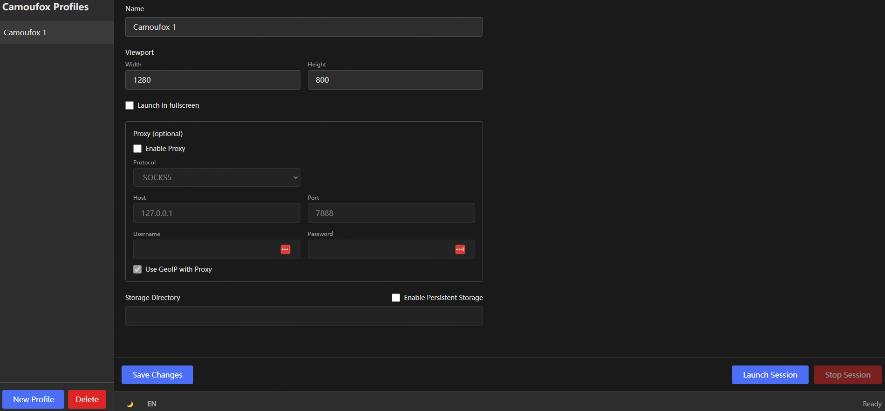

# Camoufox Profile Manager

A **modern web-based application** for managing multiple [Camoufox](https://pypi.org/project/camoufox/) browser profiles, similar to GoLogin or Multilogin.



---

## ✨ Features

- Manage unlimited browser profiles
- Persistent storage directory per profile
- Configure viewport size, fullscreen toggle
- Proxy support (host, port, user, password)
- GeoIP auto-matching with proxies
- Start / stop sessions with Camoufox
- Profiles saved to `profiles.json` locally
- Modern dark theme with smooth animations (TailwindCSS)
- Safe: disables editing controls while session is running

---

## 📦 Installation

Clone the repository:

```bash
git clone https://github.com/yourusername/camoufox-profile-manager.git
cd camoufox-profile-manager
```

Install & run with the helper script:

```bash
python run.py
```

This will:
- Check Python version (3.9+ recommended)
- Install dependencies (Flask, Flask-CORS, camoufox[geoip])
- Fetch the Camoufox browser binary (if missing)
- Start the Flask backend server
- Open your browser to http://localhost:5000

---

## 🔧 Requirements

- Python 3.9+
- Windows/Linux/macOS
- Internet (for first-time setup)
- Modern web browser (Chrome, Firefox, Edge, Safari)

---

## 🗂️ Project Structure

```
camoufox-profile-manager/
├── backend/
│   ├── app.py              # Flask REST API
│   ├── models.py           # Profile, ProxyConfig dataclasses
│   ├── storage.py          # JSON persistence logic
│   ├── session_manager.py  # Camoufox session lifecycle
│   └── validators.py       # Profile validation
├── frontend/
│   ├── index.html          # Single-page web UI
│   ├── style.css           # Dark theme styles
│   └── app.js              # Frontend logic (fetch API, state management)
├── run.py                  # One-command launcher
├── profiles.json           # Data file (auto-created)
└── README.md               # This file
```

---

## 🚀 Usage

**Start the app**:
```bash
python run.py
```

**Create a profile**:
1. Click "New Profile" button in the left sidebar
2. Enter profile name (e.g., "Work Browser")
3. Configure viewport size (default: 1280x800)
4. (Optional) Set proxy settings if needed
5. (Optional) Change storage directory
6. Click "Save Changes"

**Launch a browser**:
1. Select a profile from the list
2. Click "Launch Session" button
3. Camoufox browser opens with your settings
4. Browse normally
5. Click "Stop Session" when done

**Edit a profile**:
1. Select profile from list
2. Modify any settings in the right panel
3. Click "Save Changes"

**Delete a profile**:
1. Select profile from list
2. Click "Delete" button
3. Confirm deletion in the prompt

---

## 📋 Roadmap / TODO

- Profile metadata (homepage, tags, notes)
- Profile cloning (duplicate)
- Export / import profiles (JSON)
- Proxy testing (IP & location check)
- Proxy pools / rotation
- Multi-launch (run multiple profiles at once)
- Activity log (last launch / close)
- Color tags for profiles
- Dashboard landing page
- Profile grid/card view
- Settings dialog (custom camoufox path, defaults)
- Build .exe releases with GitHub Actions (PyInstaller)

---

## 🙏 Thanks

Huge thanks to [Camoufox](https://github.com/daijro/camoufox) for providing the privacy-focused browser engine this project is built on.

---

## 🛠️ Development

**Project uses**:
- **Backend**: Flask 3.0+ (Python REST API)
- **Frontend**: HTML5 + TailwindCSS + Vanilla JavaScript
- **Architecture**: Stateless frontend, stateful backend
- **Storage**: JSON file (`profiles.json`)
- **No build process**: Zero npm, webpack, or compilation needed

**For detailed development guide**, see `specs/001-web-ui-migration/quickstart.md`

